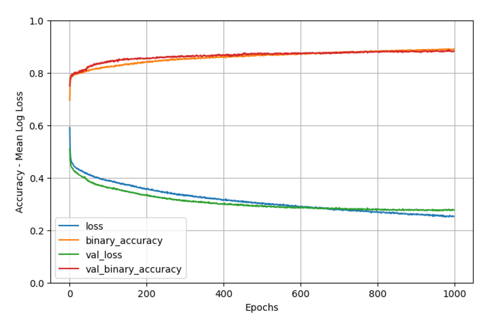

# Predicción de Cancelación de Reservas de Hotel con Redes Neuronales Profundas

Este proyecto desarrolla una red neuronal profunda para predecir la cancelación de reservas de hotel. Utiliza un dataset de 36,275 instancias y 19 variables, ajustando diversos hiperparámetros y técnicas de optimización para maximizar la precisión.

## Autores

- [Fátima Fuchun Illana Guerra](https://github.com/Fatima-Illana)
- [Cristina Fernández Gómez](https://github.com/crisfernandez)

## Descripción del Proyecto

El objetivo principal es entrenar una red neuronal profunda capaz de clasificar si una reserva será cancelada en función de datos como el número de noches, el número de adultos y el historial de cancelación del cliente. Para lograrlo, probamos diferentes combinaciones de activaciones, tasas de aprendizaje, regularización y métodos de inicialización de pesos.

El modelo final se optimiza mediante el uso de una arquitectura multicapa con activación eLU y el optimizador ADAM, alcanzando un 88% de precisión en el conjunto de prueba.

## Estructura del Proyecto

- `Introducción`: Explica el problema y el dataset utilizado.
- `Proceso de Diseño`: Describe el diseño de la red y las iteraciones de ajuste de hiperparámetros.
- `Resultados`: Presenta el modelo final y sus métricas de rendimiento.
- `Conclusiones`: Conclusiones sobre el proceso de ajuste de hiperparámetros y los resultados.

## Resultados Modelo Final

## Requisitos

- Python 3.x
- Bibliotecas: TensorFlow, Keras, NumPy, Pandas
